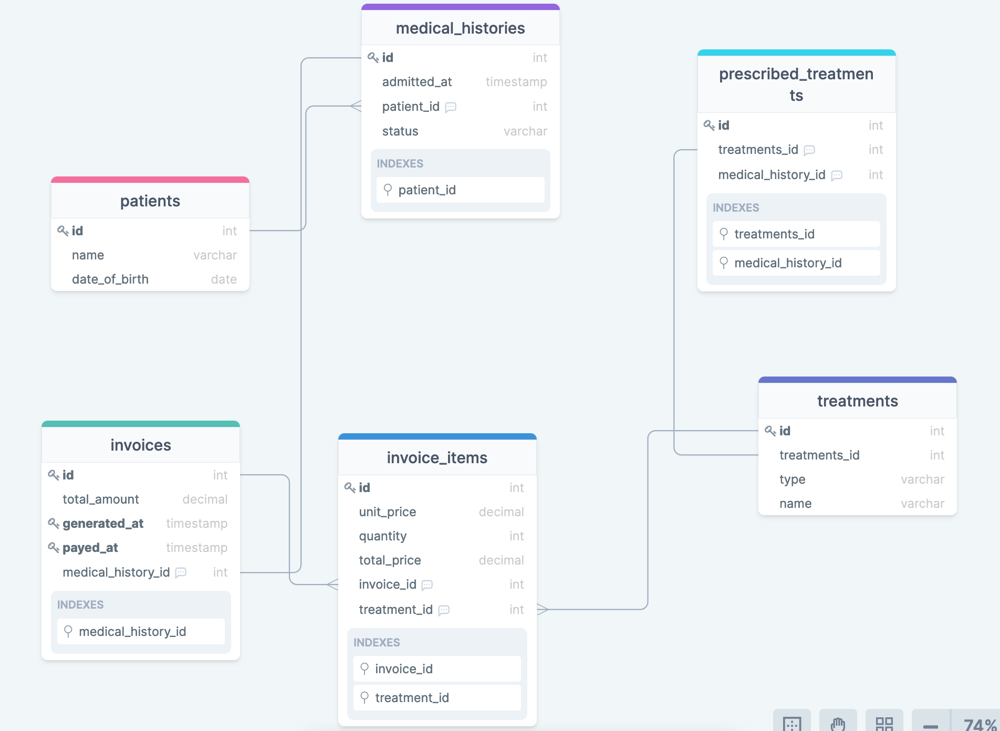

# Great Health Clinic

This is a database for a fictional clinic where the doctor/owner wanted a way to manage data efficiently. BUILT using PostgreSQL.  So far at this milestone we have been able to:
- Make use of Entity Relational Diagrams to initially map out the database before creating in our repository.

Enjoy!

## ERB Diagram

## Getting Started

This repository includes files with plain SQL that can be used to recreate a database:

- Use [schema.sql](./schema.sql) to create all tables.
- Use [data.sql](./data.sql) to populate tables with sample data.
- Check [queries.sql](./queries.sql) for examples of queries that can be run on a newly created database. **Important note: this file might include queries that make changes in the database (e.g., remove records). Use them responsibly!**

## Built with

- PostgreSQL
- Linux terminal

## Authors

👤 **Author1**

- GitHub: [@Nemwel-Boniface ](https://github.com/Nemwel-Boniface)
- Twitter: [@nemwel_bonie](https://twitter.com/nemwel_bonie)
- LinkedIn: [LinkedIn](https://www.linkedin.com/in/nemwel-nyandoro-aa1b2620b/)

👤 **STEVE W DAMES JR**

- GitHub: [@githubhandle](https://github.com/steveWDamesJr)
- Twitter: [@twitterhandle](https://twitter.com/Steve88312331)
- LinkedIn: [LinkedIn](https://www.linkedin.com/in/steve-w-dames-jr/)

Contributions, issues, and feature requests are welcome!

Feel free to check the [issues page](https://github.com/Nemwel-Boniface/Nemwel-VetClinic-db/issues).

## Show your support

Give a ⭐️ if you like this project!

## Acknowledgments

- Hat tip to anyone whose code was used
- Inspiration
- etc

## 📝 License

This project is [MIT](./MIT.md) licensed.
